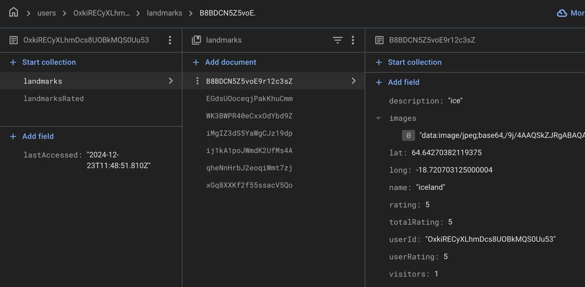
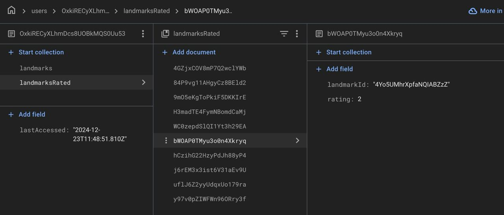

# landmark-app

## Task

Link to the [task](https://docs.google.com/document/d/1nCHuBjLxwJvzXHCDFUMZMPh5VyTI4bJj0waSy1RntHk/edit?tab=t.0#heading=h.5dt3hghpa22f).

## How to run the app

1. Clone the repo:

   ```bash
   https://github.com/Egorallo/landmark-app.git
   cd landmark-app
   ```

2. Install the necessary dependencies:

   ```bash
   npm install
   ```

3. Compile and Hot-Reload for Development:

   ```bash
   npm run dev
   ```

4. Compile and Minify for Production:

   ```bash
   npm run build
   ```

5. Lint with [ESLint](https://eslint.org/):
   ```bash
   npm run lint
   ```

## Database snapshots





## Application stack

- TypeScript
- Vue.js 3
- Vue Router
- Pinia
- Vue I18n
- Leaflet
- Firebase
- ESLint + Prettier

## Project Structure

```bash
├── src
│   ├── assets/
│   ├── components/
│   ├── i18n/
│   ├── router/
│   ├── services/
│   ├── stores/
│   ├── types/
│   ├── utils/
│   ├── views/
│   ├── main.ts/
```

- **`assets/`**: Contains CSS files.
- **`components/`**: Contains all the components.
- **`i18n/`**: Vue I18n internationalization files.
- **`router/`**: Project router.
- **`services/`**: All interactions with Firebase.
- **`stores/`**: Pinia stores.
- **`types/`**: Global types.
- **`utils/`**: Helper methods and functions.
- **`views/`**: Pages for rendering.
- **`main.ts/`**: App entry point.

## Deployed on Firebase

https://landmark-app-48b98.web.app/
